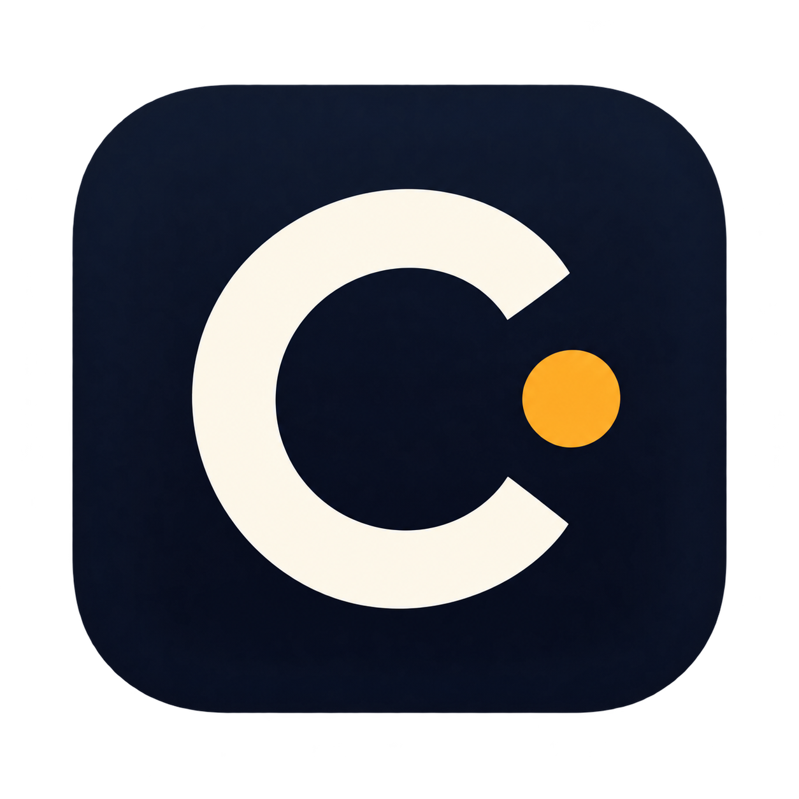

<p align="center">
  
</p>

# Cue

**Your coding sessions, one button away.**

Cue is a native macOS app that brings Claude Code terminal sessions and Codex Desktop conversations onto a shared dashboard and Stream Deck XL. See which session is working, which needs attention, and which has finished responding—then jump back to it.

Created by **[Karthik](https://github.com/Karthikm251290)**.

## Features

- A native Mac dashboard and menu bar companion.
- Shared, dynamic keys for Claude Code and Codex Desktop, with stable positions and multiple pages.
- Full project names in the inspector, editable project aliases and task labels, and recent prompt history.
- Session status shown through color, symbols, and text.
- Exact Apple Terminal tab navigation for verified Claude sessions.
- Codex conversation links and hook-based activity and permission events.
- Pulsing keys, macOS notifications, snooze, quiet mode, and reduced motion.
- Adjustable XL brightness and automatic device reconnection attempts.
- Local session storage, provider-settings backups, and start-at-login controls.

## Requirements

- **macOS 14 or later.** Development and manual testing have been on Apple silicon; Intel Macs are not yet verified.
- **Stream Deck XL, 32 keys** for physical controls. The desktop dashboard can run without it. Other Stream Deck models are not supported.
- **Claude Code in Apple Terminal**, **Codex Desktop**, or both, installed and signed in separately. Keep Codex Desktop at `/Applications/Codex.app`.
- For building: **Xcode with Swift 6 or later**, Git, and Python 3 for the optional installation helper. The current build is verified with Swift 6.3.2.
- tmux is optional and must already be installed if your Claude sessions use it.

Cue does not require an additional API key or a cloud service. It monitors your existing local sessions.

## Install from source

Prebuilt, notarized downloads are not currently provided. Build Cue on your Mac:

```sh
git clone https://github.com/Karthikm251290/cue.git
cd cue
swift --version
swift test
Build/package.sh
```

The packaged app will be at `dist/Cue.app`.

Install it into your personal Applications folder:

```sh
python3 Build/install.py
open "$HOME/Applications/Cue.app"
```

The installer stops only an existing Cue installation or its former Session Control app, backs up existing session storage and the app bundle, and installs the new build. It does not stop your Claude or Codex sessions. Python is used only by this installation helper; Cue itself is a compiled native application.

If you prefer to install manually, quit Cue, copy `dist/Cue.app` into `~/Applications`, and open it. After a manual upgrade, use the integration repair buttons to refresh an already-installed reporter.

The local build uses an ad-hoc signature and is not notarized. If macOS asks you to review the app, use its normal **Privacy & Security → Open Anyway** flow after checking the source. Do not disable Gatekeeper.

## Connect your sessions

Open **Connections & settings** in Cue.

### Claude Code

1. Install Claude monitoring using the Claude Code controls.
2. Review or reload hooks in existing Claude sessions, or restart those sessions after saving your work.
3. Send a prompt and check that Cue reports a recent Claude event.
4. Open the session from Cue. Allow access to Terminal when macOS asks.

Cue uses the original process identity and terminal device to locate the matching tab. Successful verified navigation marks that alert seen. If it cannot verify the destination, the alert stays active.

### Codex Desktop

1. Choose **Install Codex hooks**.
2. Review and trust the installed hooks. The documented review interface is `/hooks` in the Codex CLI. You can open the CLI bundled with the desktop app from Terminal:

   ```sh
   /Applications/Codex.app/Contents/Resources/codex
   ```

3. Enter `/hooks`. Review the commands pointing to `SessionControl/bin/SessionReporter` with `--codex`, and trust those entries.
4. Exit that CLI session. Once running Desktop tasks finish, quit and reopen Codex Desktop.
5. Send a prompt from the desktop app. Cue's connection status should show a recent **Last hook** timestamp.

Installed hooks do not run until trusted. See the [Codex hook documentation](https://learn.chatgpt.com/docs/hooks) for the current trust workflow.

Opening a Codex conversation does not yet confirm that it became visible. Use **Mark seen** in Cue after checking it. Cue never approves provider permission requests on your behalf.

### Stream Deck XL

1. Quit Elgato's Stream Deck application and any other software controlling the device.
2. Enable **Connect to Stream Deck XL** in Cue.
3. Adjust brightness to your preference.

Cue directly controls the XL while connected. Quit Cue or disconnect it in settings before returning control to another app.

### Notifications and login

Choose **Enable notifications** and allow the macOS request. Use **Send test** to check delivery. If blocked, open **System Settings → Notifications → Cue** and enable notifications. Focus settings can suppress banners and sounds.

Use **Start at login** if desired. If macOS requires approval, allow Cue under **System Settings → General → Login Items**.

## Use the deck

| Control | Action |
| --- | --- |
| Tap a session key | Open its Terminal session or Codex conversation |
| Hold a session key | Show full details and recent prompts in Cue |
| Tap key 32 | Switch to the next page |
| Hold key 32 | Locate the oldest unseen alert |
| Tap an empty key | Locate an attention request, if one exists |

Keys **1–31** are shared session slots. Key **32** is reserved for paging and attention. Claude and Codex do not have separate reserved regions. More sessions create additional pages without moving existing sessions. You can change positions, pin sessions, or edit names in the inspector.

| Color | Status |
| --- | --- |
| Blue | Working |
| Amber | Needs you |
| Green | Ready: the provider finished responding |
| Red | Stopped with an error |
| Gray | Idle or status unavailable |

A ready status does not certify that the task was completed correctly.

Unseen waiting/error alerts progress from a key pulse to a stronger pulse at one minute, a notification at three minutes, spare-key indicators at five minutes, and reminders starting at ten minutes. Ready sessions use a gentler reminder. Quiet mode suppresses notifications; snooze pauses an alert. Sleeping or inactive periods pause escalation time.

Closing the dashboard keeps monitoring running in the menu bar. **Quit Cue** stops monitoring and releases the device.

## Troubleshooting

| Problem | What to check |
| --- | --- |
| XL is disconnected | Close competing device controllers, reconnect USB, and re-enable the XL connection. |
| Hooks await their first event | Review/trust hooks, reload the provider as needed, and send a new prompt. |
| Claude tab cannot be verified | Check Terminal automation permission and send a fresh prompt in the original session. |
| tmux session cannot open | Attach the tmux session in Apple Terminal. Navigation requires one unambiguous attached client. |
| Notifications do not appear | Check Cue's macOS notification permission and Focus settings; try Send test. |
| Project name is shortened on a key | Open the inspector for its full name and path, or set a shorter project alias. |
| Codex alert stays active after opening | Choose Mark seen after checking the conversation. |

Connection checks show the last physical key received, navigation result, and provider receipt timestamps.

## Privacy and local data

Cue has no telemetry backend and sends no session data to a Cue server. It reads local provider metadata and transcripts and receives events from a compiled hook reporter.

Data is stored in:

```text
~/Library/Application Support/SessionControl/
```

This includes a SQLite session snapshot, queued events, the reporter executable, and configuration backups. Prompt history is limited to 30 entries per session and 32,000 characters per entry. Closed or hidden unpinned sessions expire after seven days; Codex sessions without activity for a day leave the board even if a completion event was missed. Pinned stale Codex sessions stay visible with status unavailable. Background Claude processes are excluded from the interactive session board.

The internal `SessionControl` name is retained for compatibility. Local prompts, credentials, provider settings, and session databases are not part of this repository.

## Updates and removal

To update, finish any edits to this checkout, pull the latest source, rerun the tests and build steps, then run the installer. Existing hook commands and local data paths are preserved.

To remove Cue:

1. Remove Claude monitoring and Codex hooks through Cue's settings.
2. Disable start at login and disconnect the XL.
3. Quit Cue and move `~/Applications/Cue.app` to Trash.
4. Optionally remove its Application Support folder after saving any data you need.

Hook removal targets Cue's own entries and preserves unrelated provider settings. Avoid restoring an entire settings backup over newer unrelated changes.

## Current limitations

- Early local-use release; not notarized or broadly tested across Mac hardware and provider versions.
- Codex requires manual Mark seen after navigation.
- Local provider registry, database, and transcript formats can change with provider updates.
- Cloud and remote sessions are not covered. Codex discovery scans up to 64 recently updated local conversations.
- tmux navigation requires a verified pane and a unique attached client; live coverage is still limited.
- The initial setup has user-confirmed alerts for both providers, notifications, USB reconnection, and sleep/wake recovery. Those checks do not guarantee behavior on every machine.

## Development

Cue uses SwiftUI, AppKit, IOKit, UserNotifications, ServiceManagement, and the system SQLite library. No third-party runtime libraries are bundled.

```sh
swift test          # Run regression tests
Build/package.sh   # Build and sign the local app
Build/icons.sh     # Rebuild the macOS icon from Assets/Cue.png
```

Source is organized into the native app, shared session/state logic, compiled event reporter, and macOS process/USB bridge. The test suite covers session identity, key routing, alert timing, storage, labels, paging, and icon rendering.

## Author

**Karthik** — [GitHub](https://github.com/Karthikm251290)
